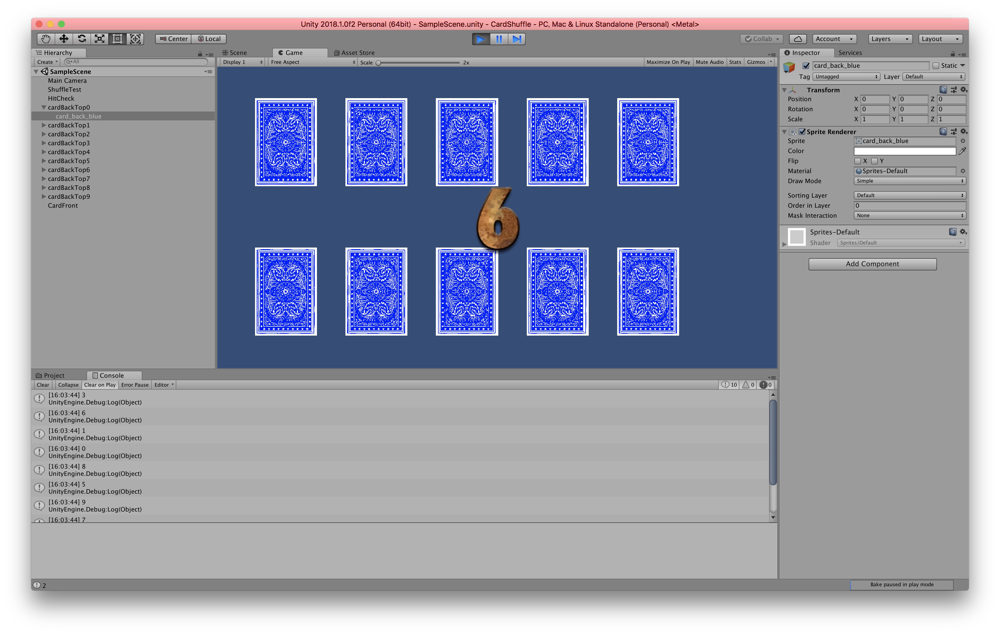

Sample project for shuffling card at start .
By clikking card sprite , Show random number from 1 to 9 .

Shuffle.cs contains randomized index and number images .
lickCheck2D.cs check which card is cliked . 

